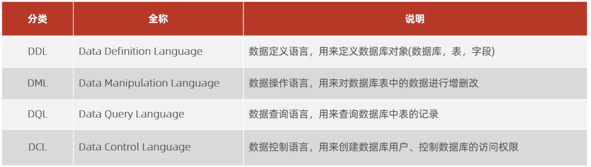

# MySQL-Note

## MySQL使用cmd连接

```
mysql [-h 127.0.0.1] [-p 3306] -u root -p
```

需提前配置环境变量

## 关系型数据库(RDBMS)

建立在关系模型的基础上，有多张互相连接的二维表组成的数据库。

特点：

1. 使用表储存数据，格式统一，便于维护
2. 使用SQL语言操作，标准统一，使用方便

## SQL

### 通用语法

1. SQL语句可以单行或多行书写，以分号结尾。
2. SQL语句可以使用空格/缩进来增强语句的可读性。
3. MySQL数据库的SQL语句不区分大小写，关键字建议大写。
4. 注释：
   - 单行注释：--注释内容 或 #注释内容(MySQL特有)
   - 多行注释：/* 注释内容 */ 

### SQL分类



### DDL-数据库操作

查询

查询所有数据库

```sql
show DATABASES;
```

查询当前数据库

```sql
select DATABASE();
```

创建

```sql
create DATABASE [if not exists] 数据库名 [default charset 字符集] [collate 排序规则];
```

如果不存在就创建，如果存在则不执行任何操作；默认字符集建议使用utf8mb4。

删除

```sql
drop DATABASE [if exists] 数据库名；
```

使用

```sql
use 数据库名;
```

#### 表操作-查询

查询当前数据库所有表

```sql
show tables;
```

查询表结构

```sql
desc 表名;
```

查询指定表的建表语句

```sql
show create table 表明;
```

#### 表操作-创建

```sql
create table 表名(
    字段1 字段1类型[comment 字段1注释]，
    字段2 字段2类型[comment 字段2注释]，
    字段3 字段3类型[comment 字段3注释]，
    ......
    字段n 字段n类型[comment 字段n注释]
)[comment 表注释];
```

**注意：最后一个字段后面没有逗号。**

#### 数据类型

##### 数值类型

| 类型           | 大小（byte） | 描述                 |
| -------------- | ------------ | -------------------- |
| Tintint        | 1            | 小整数值             |
| Smallint       | 2            | 大整数值             |
| mediumint      | 3            | 大整数值             |
| Int or Integer | 4            | 大整数值             |
| Bigint         | 8            | 极大整数值           |
| Float          | 4            | 单精度浮点数值       |
| Double         | 8            | 双精度浮点数值       |
| Decimal        |              | 小数值（精确定点数） |

无符号可以附加unsigned。

double定义时需指定整体位数以及小数位数，如double(4,1)；即整体四位，小数位一位。

##### 字符串类型

| 类型       | 大小（byte） | 描述                         |
| ---------- | ------------ | ---------------------------- |
| Char       | 0-255        | 定长字符串                   |
| Varchar    | 0-65535      | 变长字符串                   |
| Tinyblob   | 0-255        | 不超过255个字符的二进制数据  |
| Tinytext   | 0-255        | 短文本字符串                 |
| Blob       | 0-65535      | 二进制形式的的长文本数据     |
| Text       | 0-65535      | 长文本数据                   |
| Mediumblob | 0-16777215   | 二进制形式的中等长度文本数据 |
| Mediumtext | 0-16777215   | 中等长度文本数据             |
| Longblob   | 0-4294967295 | 二进制形式的直达文本数据     |
| Longtext   | 0-4294967295 | 极大文本数据                 |

注意：如使用char(10)，即便定义一个字符，也会占用十个字符的空间，空余的位置用空格补全；

使用varchar，则会灵活变通所占空间大小。

| 类型      | 大小 | 范围                                       | 格式                | 描述                     |
| --------- | ---- | ------------------------------------------ | ------------------- | ------------------------ |
| Data      | 3    | 1000-01-01 至 9999-12-31                   | YYYY-MM-DD          | 日期值                   |
| Time      | 3    | -838:59:59 至 838:59:59                    | HH:MM:SS            | 时间值或持续时间         |
| Year      | 1    | 1901 至 2155                               | YYYY                | 年份值                   |
| Datatime  | 8    | 1000-01-01 00:00:00 至 9999-12-31 23:59:59 | YYYY-MM-DD HH:MM:SS | 混合日期和时间值         |
| Timestamp | 4    | 1970-01-01 00:00:01 至 2038-01-19 03:14:07 | YYYY-MM-DD HH:MM:SS | 混合日期和时间值，时间戳 |

#### 表操作-修改

添加字段

```sql
alter table 表名 add 字段名 类型(长度) [comment 注释] [约束];
```

修改数据类型

```sql
alter table 表名 modify 字段名 新数据类型(长度);
```

修改字段名和字段类型

```sql
alter table 表名 change 旧字段名 新字段名 类型(长度) [comment 注释] [约束];
```

删除字段

```sql
alter table 表名 drop 字段名;
```

修改表名

```sql
alter table 表名 rename to 新表名;
```

#### 表操作-删除

删除表

```sql
drop table [if exists] 表名;
```

删除指定表，并重新创建该表

```sql
truncate table 表名;
```

